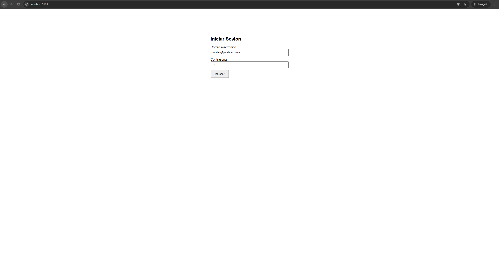
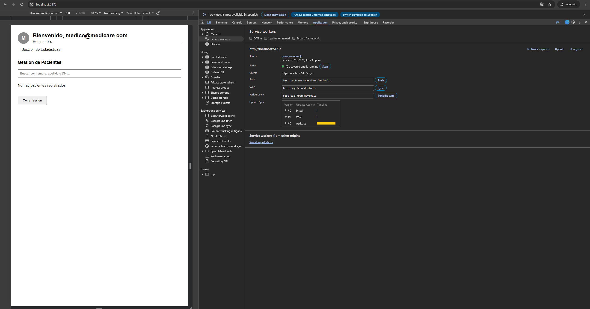
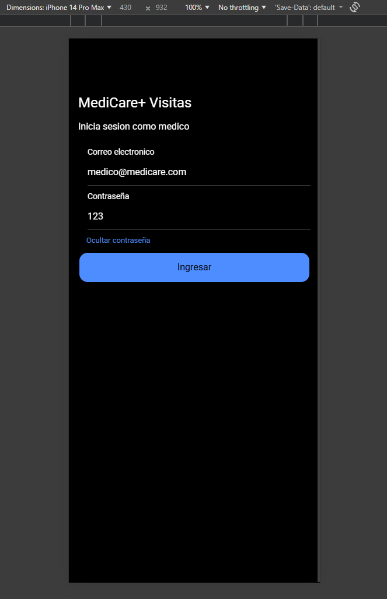
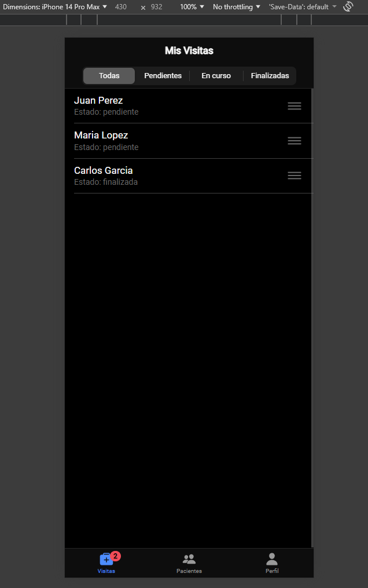

# Parcial 1 - MediCare+ (Desarrollo de Software para Plataformas Móviles)
**Realizado por:** Isaac Piedrahita - Universidad Autónoma de Occidente

**Docente:** Jonathan Lopez Londoño

Este repositorio contiene los dos proyectos solicitados para el Parcial 1 de Desarrollo de Software Móvil.

## 1. Ejercicio 1: PWA Administración Web (`/Parcial1-PWA`)
Aplicación en React (Vite) para el personal administrativo. 

**Lo que incluye:**
* Inicio de sesión persistente usando `localStorage`.
* Renderizado condicional según el rol (Recepcionista o Médico).
* Gestión de pacientes (CRUD completo con alta, edición y eliminación usando `window.confirm`).
* Búsqueda dinámica por nombre, apellido o DNI.
* DNI validado manualmente por estado (solo números, 7 a 8 caracteres).
* Avatar dinámico en el header (muestra la foto o la inicial del correo).
* Configuración completa de PWA (manifest y service worker con estrategia Cache First).

**Para probarlo:**
* Usuario Admin: `admin@medicare.com` / Clave: `123`
* Usuario Médico: `medico@medicare.com` / Clave: `123`

**Pantallazos:**



---

## 2. Ejercicio 2: App Móvil Visitas Médicas (`/Parcial1-Ionic`)
Aplicación en Ionic React para los médicos que atienden a domicilio.

**Lo que incluye:**
* Login simulado con retraso (`IonLoading`), alertas de error (`IonToast`) y botón para ver/ocultar contraseña.
* Navegación principal con Tabs (Visitas, Pacientes, Perfil) y rutas anidadas para ver el detalle de la visita.
* Guardia de rutas que redirige al login si no hay sesión activa.
* El Perfil usa `IonAvatar` para la foto o inicial.
* La lista de visitas permite deslizar (`IonItemSliding`) para cambiar de estado o cancelar (abre un `IonAlert` para el motivo), y también permite reorganizar la lista arrastrando (`IonReorderGroup`).
* Filtros de visitas con `IonSegment`.
* Un `IonBadge` dinámico en la barra inferior que se actualiza con la cantidad de visitas pendientes.

**Para probarlo:**
* Usuario: `medico@medicare.com` / Clave: `123`

**Pantallazos:**




---

 ## Tutorial de Ejecución

### PWA (Ejercicio 1)
```bash
cd Parcial1-PWA
npm install
npm run dev
```

### App Ionic (Ejercicio 2)
```bash
cd Parcial1-Ionic
npm install
npm run dev 